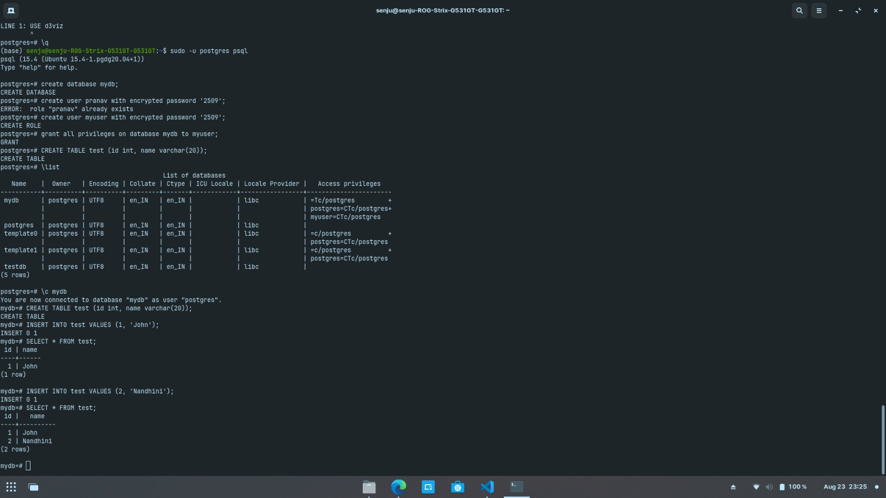

# Programs

## 1) Hello world

Download `d3.min.js` from [d3js.org](https://d3js.org/) or else from [here](https://www.cdnpkg.com/d3/file/d3.min.js/)

Create a file `hello.html` with the following content:

```html
<!DOCTYPE html>
<html>
<head>
    <meta charset="utf-8">
    <title>Hello World</title>
    <script src="d3.min.js"></script>
</head>
<body>
    <script>
        d3.select("body").append("p").text("Hello World!");
    </script>
</body>
</html>
```
in the above code Basically D3 will select the body element and append a paragraph element with the text "Hello World!".

or else you can use the following code:

```html
<!DOCTYPE html>
<html>
   <head>
      <script type = "text/javascript" src = "https://d3js.org/d3.v4.min.js"></script>
   </head>

   <body>
      <div class = "myclass">
         Hello World!
      </div>
      
      <script>
         d3.select("div.myclass").append("span").text("from D3.js");
      </script>
   </body>
</html>
``` 

## 2) Load data from postgresql and display it in a table

```bash
$sudo -u postgres psql
```
create a database
```sql
$ postgres=# CREATE DATABASE mydb;
```
use the database
```sql
$ postgres=# \c mydb
```

create a table
```sql
$ postgres=# CREATE TABLE test (id int, name varchar(20));
```
insert some data
```sql
$ postgres=# INSERT INTO test VALUES (1, 'John');
$ postgres=# INSERT INTO test VALUES (2, 'Jane');
```
select data
```sql
$ postgres=# SELECT * FROM test;
```

exit from postgresql
```sql
$ postgres=# \q
```



```sql
CREATE USER youruser WITH ENCRYPTED PASSWORD 'yourpass';
GRANT ALL PRIVILEGES ON DATABASE yourdbname TO youruser;
```
alter user <username> with encrypted password '<password>'